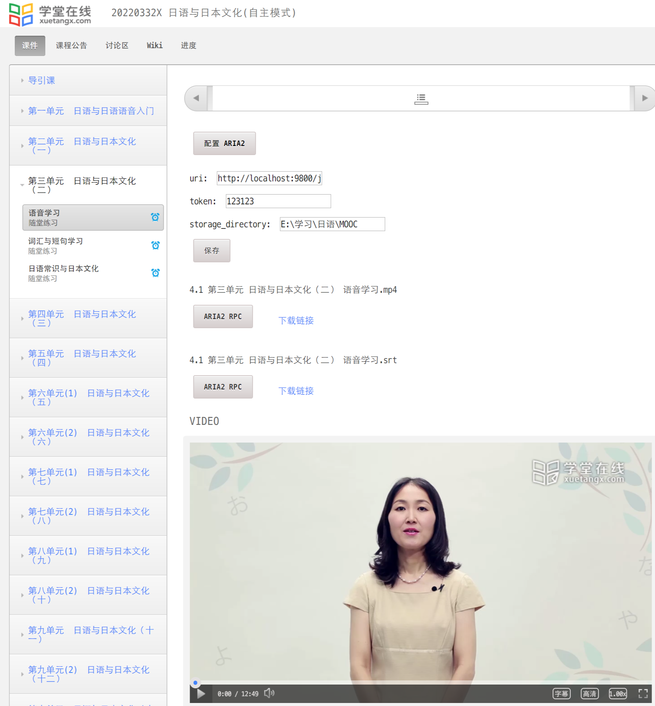

## 学堂在线 课程视频及字幕 aria2下载脚本

### Why

想便捷地下载学堂在线MOOC视频到本地播放，然而视频和字幕的文件名比较乱，不方便播放和收藏

### 功能预览

1.  提取视频和字幕的链接
2.  按照上下文自动生成文件名
3.  点击按钮通过 JOSN-RPC 调用 aria2 下载至指定文件夹

### 安装方法

1.  安装脚本管理浏览器扩展

    [Tempermonkey](https://tampermonkey.net/) 或  [Violentmonkey](https://violentmonkey.github.io/) 或 [Greasemonkey](https://addons.mozilla.org/en-US/firefox/addon/greasemonkey/)

2.  关于 aria2 下载软件，参考 [(下载+教学) aria2 1.32 开源下载器，BT磁力，多线程，百度网盘

    ](https://www.gdaily.org/12361/aria2-download-torrent-bt)

3.  访问 安装此脚本

##### 授权

MIT

